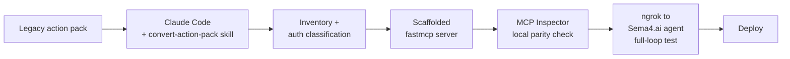

# Migration workflow

This is the end-to-end loop for converting one Sema4.ai action pack to a
remote MCP server. Most of the heavy lifting is done by Claude Code plus
the [`convert-action-pack`](../.claude/skills/convert-action-pack/SKILL.md)
skill — this page walks you through what to expect at each step and where
to stay in the loop.

> Before starting, confirm the action should actually migrate. Run the
> [decision tree](01-decide.md) — SQL-first actions become SDM Verified
> Queries, not MCPs.
>
> Migrating a whole **exported agent** (a `.zip` bundling several packs)
> rather than a single pack? Run the
> [`analyze-agent-zip`](../.claude/skills/analyze-agent-zip/SKILL.md) skill
> first — it unpacks the export, applies the decision tree per pack, and
> produces a plan plus a customer-requirements checklist. Then run the loop
> below for each pack that lands on "migrate to MCP".

## The loop, at a glance



Each step has a fast feedback signal. Only move on when the previous one
is clean.

## Prerequisites

- **Claude Code** — with this repo cloned (or the skill directory copied
  into your Claude Code setup), Claude Code auto-loads the skill whenever
  you open a workspace that sees `.claude/skills/convert-action-pack/`.
- **Python 3.12+** and **uv**.
- **MCP Inspector** — `npx @modelcontextprotocol/inspector` when you need
  it.
- **ngrok** — for the full-loop test against a Sema4.ai agent.
- **A Sema4.ai agent** you can register the MCP with — either an existing
  agent or a scratch one for testing.

## Step 1 — Inventory the action pack

Open Claude Code in a workspace that can see the legacy pack. Ask:

> Migrate the action pack at `path/to/my-action-pack/` to an MCP server.
> Use the convert-action-pack skill.

The skill starts with an inventory pass and returns a table like this:

| Legacy action   | Target tool name | Read/mutate | Auth type | Platform context? | Uses thread files? | Notes |
| --------------- | ---------------- | ----------- | --------- | ----------------- | ------------------ | ----- |
| `send_message`  | `send_message`   | mutating    | OAuth     | no                | no                 | —     |
| `list_threads`  | `list_threads`   | read        | OAuth     | yes               | no                 | —     |
| `attach_report` | `attach_report`  | mutating    | OAuth     | yes               | yes                | thread files overlay |

Review the table before anything else. **This is the single best place to
catch silent regressions** — if a tool is missing, renamed, or classified
wrong, say so before scaffolding begins. Claude Code will pause here and
wait for your sign-off.

### If the pack has `@query` functions

The skill splits those out and returns **SDM Verified Query** definitions
ready to paste into your agent's Semantic Data Model configuration. They
do not become MCP tools. Paste the output into Studio, check parameter
types, and carry on with the remaining `@action` functions (if any).

## Step 2 — Confirm auth and context classification

The skill classifies each tool's auth independently: API-key, OAuth, or no
auth, plus optional platform-context extraction (`X-Tool-Invocation-Context`
parsing) and optional thread-file overlay (`sema4ai-api-client` + request-
bound context vars).

If you're unsure about any classification, point Claude Code at the legacy
code and ask it to re-check — don't argue from memory. The classification
drives which snippets get scaffolded, so getting it right now saves
rework.

## Step 3 — Scaffold the fastmcp server

Once the inventory and auth are confirmed, Claude Code scaffolds the new
server. By default:

```
my-service-mcp/
├── server.py
├── pyproject.toml
├── uv.lock
├── models.py                optional — Pydantic models for complex tools
├── client.py                optional — vendor SDK wrapper
└── tests/
    ├── conftest.py
    ├── test_smoke.py
    ├── test_tools.py
    └── test_context.py      only if context / thread-files overlay applies
```

Tools are annotated with `ToolAnnotations(readOnlyHint=…, destructiveHint=…)`
per the inventory. Context-header parsing and thread-file helpers are
inlined only when the classification says they're needed — no dead code.

## Step 4 — Local parity check with MCP Inspector

One terminal:

```bash
cd my-service-mcp
uv sync
uv run python server.py
```

Another terminal:

```bash
npx @modelcontextprotocol/inspector
# point it at http://localhost:8067/mcp
```

Walk each tool:

- Does it appear in the list?
- Is the description clear enough that a different agent would know when
  to call it?
- Does the happy path work when you invoke it?
- Does the error path return a useful message?

This is where tool-metadata issues surface — before the Sema4.ai agent
ever sees the MCP.

> Claude Code can drive this for you. "Spot-check each tool through MCP
> Inspector and report back" is a reasonable prompt.

## Step 5 — Full-loop test against a Sema4.ai agent

Local invocation doesn't exercise the `X-Tool-Invocation-Context` header,
OAuth forwarding, or streamable-HTTP session behavior end-to-end. ngrok
does.

```bash
ngrok http 8067
# → https://<subdomain>.ngrok.app
```

Register `https://<subdomain>.ngrok.app/mcp` on your Sema4.ai agent as an
MCP server, then ask the agent to invoke one of the tools. Watch your
local `server.py` logs — the context header arrives, any auth header
arrives, the tool runs, the response returns.

This step usually shakes out the last one or two issues the inventory
missed: a header-name typo, a Pydantic model mismatch, a missing
dependency. Fix, restart `python server.py`, rerun from the agent. The
ngrok tunnel URL stays the same across server restarts.

## Step 6 — Deploy

Pick one:

- [Cloud Run](07-orchestration/cloud-run.md)
- [Bedrock AgentCore](07-orchestration/bedrock-agentcore.md)
- [Azure Container Apps](07-orchestration/azure-container-apps.md)
- [Multi-MCP gateway](07-orchestration/gallery-pattern.md) — bundle several
  migrated MCPs behind one endpoint.

Once deployed, re-register the production URL on the Sema4.ai agent,
retire the ngrok URL, and retire the legacy action pack in Control Room.

## Tips

- **Don't skip the inventory review.** Silent regressions at that stage
  are the most expensive ones — they surface only when agents misbehave
  in production.
- **Let Claude Code re-read legacy code when you're unsure.** The fastest
  way to settle a classification question is "go check
  `path/to/actions.py` and confirm this is OAuth."
- **Prefer one round trip per tool.** If a tool does two independent
  things, split it. Tool descriptions should fit on a screen.
- **Keep the original pack around.** Parity testing is much easier when
  you can run the legacy action side-by-side against the new MCP.
- **Write one smoke test early.** `test_smoke.py` — import the server,
  list tools, assert the expected names — catches a lot for a line of
  work.
- **Name the MCP directory `{service}-mcp/`**, and the `pyproject.toml`
  project `mcp-{service}`, so it's unambiguous what the directory is and
  it doesn't collide with vendor SDK packages.

## What's next

- Sema4.ai-specific patterns in depth: [05-sema4-patterns.md](05-sema4-patterns.md)
  — context headers, auth, files.
- [Tools and testing](06-tools-and-testing.md) — tool design +
  three-layer test strategy + parity.
