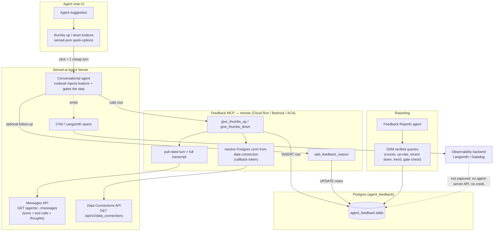
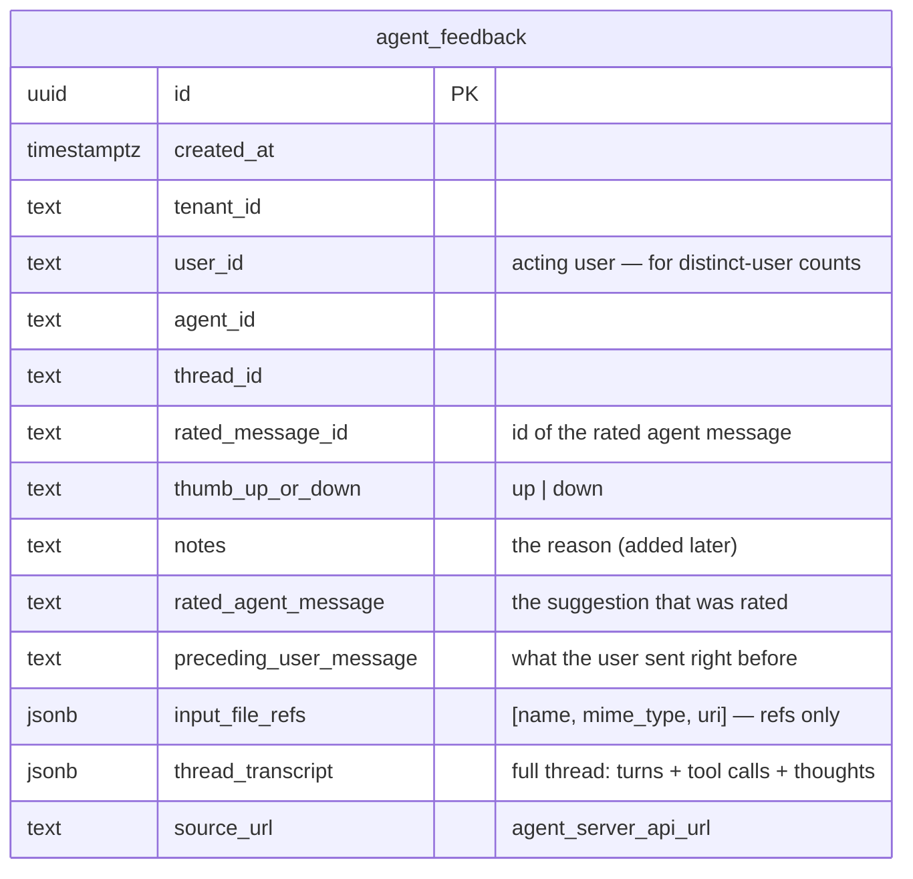

# Agent Feedback — Architecture

How thumbs up/down feedback is captured inside an agent run and stored for
reporting. Renders on GitHub. Three views: **system**, **flow**, **data**, plus
an **included / missing** summary.

## System (what lives where)



## Flow (one feedback, end to end)

```mermaid
sequenceDiagram
  actor U as User
  participant AS as Agent Server (agent + APIs)
  participant M as Feedback MCP
  participant DB as Postgres

  AS->>U: suggestion + 👍/👎 quick-options
  Note over AS: runbook: do not continue until a thumb is chosen
  U->>AS: clicks 👎  (sends "feedback: 👎" = new turn)
  AS->>M: give_thumbs_down()
  M->>AS: GET /data_connections  (resolve Postgres conn)
  M->>AS: GET /messages  (rated turn + full transcript)
  M->>DB: INSERT feedback row (verdict, suggestion, prior input, transcript)
  M-->>AS: feedback_id
  AS->>U: "Add a reason? (optional)"
  U->>AS: reason text
  AS->>M: add_feedback_reason(reason, feedback_id)
  M->>DB: UPDATE notes on that row
  M-->>AS: saved
  Note over AS,DB: no agent turn is needed to read; Reports agent queries via SDM
```

## Data object: `agent_feedback`



## Included / Missing

| Area | Status | Notes |
| --- | --- | --- |
| Thumbs up/down buttons | ✅ Included | Native `sema4-json` quick-options, runbook-injected — zero platform change. |
| Capture verdict on click | ✅ Included | `give_thumbs_up` / `give_thumbs_down` (one cheap turn per click). |
| Rated suggestion + preceding user input | ✅ Included | Pulled authoritatively from the messages API. |
| Input file references | ✅ Included | Refs only (name / mime / uri), not bytes. |
| Full thread transcript (turns + tool calls + thoughts) | ✅ Included | `thread_transcript` JSONB, captured at feedback time. |
| Follow-up reason | ✅ Included | `add_feedback_reason(reason, feedback_id?)` updates the row. |
| DB connection | ✅ Included | Resolved from the `agent-feedback-neon` data connection (no secret), env/header override. |
| Reporting | ✅ Included | Read-only SDM + verified queries; `Feedback Reports` agent. |
| Raw OTel / Langsmith spans (timing, tokens, nested spans) | ❌ Missing | Not exposed by the agent-server API the MCP can reach; needs a Langsmith/Datadog API key wired into the MCP. |
| Silent (no-turn) click capture | ❌ Missing (by choice) | Would require a platform frontend change; we accepted a 1-turn click. |
| Guaranteed always-on buttons | ⚠️ Runbook-driven | Model emits the block each turn; deterministic display would need a platform change. |
| File bytes | ❌ Missing (by choice) | Refs only. |
```
